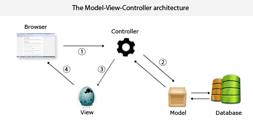

# PHP-MVC框架

> 抛开那些有的没的，好好从开发学起
>

# MVC简介

**MVC模式** （Model-View-Controller）是软件工程中的一种 **软件架构模式** 。 MVC把软件系统分为三个基本部分： **模型** （Model）、 **视图** （View）和 **控制器** （Controller）。 PHP中MVC模式也称 **Web MVC** ，从上世纪70年代进化而来。 MVC的目的是实现一种动态的程序设计， **便于后续对程序的修改和扩展简化** ，并且使程序某一部分的重复利用成为可能。 除此之外，此模式通过对复杂度的简化，使程序结构更加直观。 MVC各部分的职能：

* **模型Model** – 管理**大部分的业务逻辑**和 **所有的数据库逻辑** 。模型提供了连接和操作**数据库**的抽象层。
* **控制器Controller** – 负责 **响应用户请求** 、 **准备数据** ，以及决定如何展示数据。
* **视图View** – 负责 **渲染数据** ，通过HTML方式呈现给用户。

## MVC典型流程



1、Controller截获用户发出的请求；

2、Controller调用Model完成状态的读写操作；

3、Controller把数据传递给View；

4、View渲染最终结果并呈献给用户。

# 开发自己的框架

## 环境准备

```‘
Apache2.4.39+php7.4.3+MYSQL5.7.26
```

### 代码规范

在目录设置好以后，我们接下来规定代码的规范：

1、MySQL的表名需**小写**或 **小写加下划线** ，如：`item`，`car_orders`。

2、模块名（Models）需用 **大驼峰命名法** ，即首字母 **大写** ，并在名称后添加`Model`，如：`ItemModel`，`CarModel`。

3、控制器（Controllers）需用 **大驼峰命名法** ，即首字母 **大写** ，并在名称后添加`Controller`，如：`ItemController`，`CarController`。

4、方法名（Action）需用 **小驼峰命名法** ，即首字母 **小写** ，如：`index`，`indexPost`。

5、视图（Views）部署结构为 **控制器名/行为名** ，如：`item/view.php`，`car/buy.php`。

### 目录示例

```‘
project                 WEB部署根目录

├─app                   应用目录

│  ├─controllers        控制器目录

│  ├─models             模块目录

│  ├─views              视图目录

├─config                配置文件目录

├─fastphp               框架核心目录

│ ├─base                MVC基类目录

│ ├─db                  数据库操作类目录

│ ├─Fastphp.php         内核文件  

├─static                静态文件目录

├─index.php             入口文件
```

### 设置重定向

利用.htaccess把所有的请求都重定向到`index.php`也就是入口文件中。

```php
<IfModule mod_rewrite.c>
# 打开Rerite功能
RewriteEngine On
    # 如果请求的是真实存在的文件或目录，直接访问
    RewriteCond %{REQUEST_FILENAME} !-f
    RewriteCond %{REQUEST_FILENAME} !-d

    # 如果访问的文件或目录不是真事存在，分发请求至 index.php
    RewriteRule . index.php
</IfModule>
```

## 构建核心文件

### 入口文件

index.php

```php
<?php

// 应用目录为当前目录
define('APP_PATH', __DIR__ . '/');

// 开启调试模式
define('APP_DEBUG', true);

// 加载框架文件
require(APP_PATH . 'xbphp/Xbphp.php');

// 加载配置文件
$config = require(APP_PATH . 'config/config.php');

// 实例化框架类
(new xbphp\Xbphp($config))->run();
```

前四个都是定义加载配置，最后执行了框架类的run方法

### 配置文件

config.php

```php
<?php
// 数据库配置
$config['db']['host'] = 'localhost';
$config['db']['username'] = 'root';
$config['db']['password'] = 'root';
$config['db']['dbname'] = 'xbphp';

// 默认控制器和操作名
$config['defaultController'] = 'Item';
$config['defaultAction'] = 'index';

return $config;
```

保存了数据库配置和默认配置，最后就是一个`$config`数组返回回去。

作为参数给到框架核心类中

### 框架核心类

就是Xbphp.php文件

实例化操作接受`$config`参数配置，并保存到对象属性中。

`run()`方法则调用用类自身方法，完成下面几个操作：

* **类自动加载**
* **环境检查**
* **过滤敏感字符**
* **移除全局变量的老用法**
* **路由处理**

Xbphp.php

```php
<?php
namespace xbphp;

//框架根目录
define('CORE_PATH') or define('CORE_PATH', __DIR__);

/**
 * 我们的框架核心类Xbphp
 */

class Xbphp{
    //config配置内容
    protected $config = [];

    public function __construct($config)
    {
        $this->config = $config;
    }

    //run方法，运行程序
    public function run()
    {
        $this->route();
    }

    /**
     * route方法
     * 路由处理
     *
     * 1.对传入的url进行解析，获取到控制器，操作，还有传入的参数，这些都要符合你一开始定的url规范
     * 比如index.php/controller/method/param1/param2这样
     *
     * 2.实例化了具体的控制器，并调用方法，传入参数
     */
    public function route()
    {
        //默认的控制器名和操作名，还要传入的参数
        $controllerName = $this->config['defaultController'];
        $actionName = $this->config['defaultAction'];
        $param = array();

        //对传入的url进行解析
        $url = $_SERVER['REQUEST_URI'];
        $position = strpos($url, '?');

        $url = $position === false ? $url : substr($url, 0, $position);
        // 删除前后的“/”
        $url = trim($url, '/');

        if ($url) {
            // 使用“/”分割字符串，并保存在数组中
            $urlArray = explode('/', $url);
            // 删除空的数组元素
            $urlArray = array_filter($urlArray);

            // 获取控制器名
            $controllerName = ucfirst($urlArray[0]);
            // 获取动作名
            array_shift($urlArray);
            $actionName = $urlArray ? $urlArray[0] : $actionName;
            // 获取URL参数
            array_shift($urlArray);
            $param = $urlArray ? $urlArray : array();
        }

        // 判断控制器和操作是否存在
        $controller = 'app\\controllers\\'. $controllerName . 'Controller';
        if (!class_exists($controller)) {
            exit($controller . '控制器不存在');
        }

        if (!method_exists($controller, $actionName)) {
            exit($actionName . '方法不存在');
        }

        // 如果控制器和操作名存在，则实例化控制器，因为控制器对象里面
        // 还会用到控制器名和操作名，所以实例化的时候把他们俩的名称也
        // 传进去。结合Controller基类一起看
        $dispatch = new $controller($controllerName, $actionName);

        // $dispatch保存控制器实例化后的对象，我们就可以调用它的方法，
        // 也可以像方法中传入参数，以下等同于：$dispatch->$actionName($param)
        call_user_func_array(array($dispatch, $actionName), $param);
    }

    //检测开发环境
    public function setReporting()
    {
        if (APP_DEBUG === true) {
            error_reporting(E_ALL);
            ini_set('display_errors','On');
        } else {
            error_reporting(E_ALL);
            ini_set('display_errors','Off');
            ini_set('log_errors', 'On');
        }
    }

    // 删除敏感字符，当然这里也是调用函数来进行，没有具体的白名单黑名单
    public function stripSlashesDeep($value)
    {
        $value = is_array($value) ? array_map(array($this, 'stripSlashesDeep'), $value) : stripslashes($value);
        return $value;
    }

    // 检测下面四个数组中的敏感字符并删除
    public function removeMagicQuotes()
    {
        if (get_magic_quotes_gpc()) {
            $_GET = isset($_GET) ? $this->stripSlashesDeep($_GET ) : '';
            $_POST = isset($_POST) ? $this->stripSlashesDeep($_POST ) : '';
            $_COOKIE = isset($_COOKIE) ? $this->stripSlashesDeep($_COOKIE) : '';
            $_SESSION = isset($_SESSION) ? $this->stripSlashesDeep($_SESSION) : '';
        }
    }

    //检测自定义全局变量并移除。因为 register_globals 已经弃用，如果
    //已经弃用的 register_globals 指令被设置为 on，那么局部变量也将
    //在脚本的全局作用域中可用。 例如， $_POST['foo'] 也将以 $foo 的
    //形式存在，这样写是不好的实现，会影响代码中的其他变量。
    public function unregisterGlobals()
    {
        if (ini_get('register_globals')) {
            $array = array('_SESSION', '_POST', '_GET', '_COOKIE', '_REQUEST', '_SERVER', '_ENV', '_FILES');
            foreach ($array as $value) {
                foreach ($GLOBALS[$value] as $key => $var) {
                    if ($var === $GLOBALS[$key]) {
                        unset($GLOBALS[$key]);
                    }
                }
            }
        }
    }

    //配置数据库信息
    public function setDbConfig()
    {
        if ($this->config['db']) {
            define('DB_HOST', $this->config['db']['host']);
            define('DB_NAME', $this->config['db']['dbname']);
            define('DB_USER', $this->config['db']['username']);
            define('DB_PASS', $this->config['db']['password']);
        }
    }
    // 自动加载类
    public function loadClass($className)
    {
        $classMap = $this->classMap();

        if (isset($classMap[$className])) {
            // 包含内核文件
            $file = $classMap[$className];
        } elseif (strpos($className, '\\') !== false) {
            // 包含应用（application目录）文件
            $file = APP_PATH . str_replace('\\', '/', $className) . '.php';
            if (!is_file($file)) {
                return;
            }
        } else {
            return;
        }
        include $file;
    }

    // 内核文件命名空间映射关系
    protected function classMap()
    {
        return [
            'xbphp\base\Controller' => CORE_PATH . '/base/Controller.php',
            'xbphp\base\Model' => CORE_PATH . '/base/Model.php',
            'xbphp\base\View' => CORE_PATH . '/base/View.php',
            'xbphp\db\Db' => CORE_PATH . '/db/Db.php',
            'xbphp\db\Sql' => CORE_PATH . '/db/Sql.php',
        ];

    }
}
```

### Controller基类

对模型类View进行操作

用`assign()`方法实现 **把变量保存到View对象中** 。 这样，在调用`$this->render()` 后视图文件就能显示这些变量。

```php
<?php
namespace xbphp\base;

/**
 * 控制器基类
 */

class Controller{
    protected $_controller;
    protected $_action;
    protected $_view;

    // 构造函数，初始化属性，并实例化对应模型
    public function __construct($controller, $action)
    {
        $this->_controller = $controller;
        $this->_action = $action;
        $this->_view = new View($controller, $action);
    }

    // 分配变量
    public function assign($name, $value)
    {
        $this->_view->assign($name, $value);
    }


    // 渲染视图
    public function render()
    {
        $this->_view->render();
    }

}
```

### Model基类

```php
<?php
namespace xbphp\base;

use xbphp\db\Sql;

class Model extends Sql
{
    protected $model;

    public function __construct()
    {
        // 获取数据库表名
        if (!$this->table) {
            // 获取模型类名称
            $this->model = get_class($this);
            // 删除类名最后的 Model 字符
            $this->model = substr($this->model, 0, -5);
            // 数据库表名与类名一致
            $this->table = strtolower($this->model);
        }
    }
}
```

以及它继承的sql类，这个类比较核心

> 因为通过它，我们创建了一个 SQL 抽象层，可以大大减少了数据库的编程工作。 虽然 PDO 接口本来已经很简洁，但是抽象之后框架的可灵活性更高。 `Sql`类里面有用到`Db:pdo()`方法，这是我们创建的`Db`类，它提供一个PDO单例。
>

```php
<?php
namespace xbphp\db;

use \PDOStatement;

class Sql
{
    // 数据库表名
    protected $table;

    // 数据库主键
    protected $primary = 'id';

    // WHERE和ORDER拼装后的条件
    private $filter = '';

    // Pdo bindParam()绑定的参数集合
    private $param = array();


    /**
     * 查询条件拼接，使用方式：
     *
     * $this->where(['id = 1','and title=Web', ...])->fetch();
     * 为防止注入，建议通过$param方式传入参数：
     * $this->where(['id = :id'], [':id' => $id])->fetch();
     *
     * @param array $where 条件
     * @return $this 当前对象
     */
    public function where($where = array(), $param = array())
    {
        if ($where) {
            $this->filter .= ' WHERE ';
            $this->filter .= implode(' ', $where);

            $this->param = $param;

        }

        return $this;

    }


    /**
     * 拼装排序条件，使用方式：
     *
     * $this->order(['id DESC', 'title ASC', ...])->fetch();
     *
     * @param array $order 排序条件
     * @return $this
     */

    public function order($order = array())
    {
        if($order) {
            $this->filter .= ' ORDER BY ';
            $this->filter .= implode(',', $order);
        }

        return $this;
    }


    // 查询所有
    public function fetchAll()
    {
        $sql = sprintf('select * from `%s` %s', $this->table, $this->filter);
        $sth = Db::pdo()->prepare($sql);
        $sth = $this->formatParam($sth, $this->param);
        $sth->execute();

        return $sth->fetchAll();
    }


    // 查询一条
    public function fetch()
    {
        $sql = sprintf('select * from `%s` %s', $this->table, $this->filter);
        $sth = Db::pdo()->prepare($sql);
        $sth = $this->formatParam($sth, $this->param);
        $sth->execute();

        return $sth->fetch();

    }


    // 根据条件 (id) 删除
    public function delete($id)
    {
        $sql = sprintf('delete from `%s` where `%s` = :%s', $this->table, $this->primary, $this->primary);
        $sth = Db::pdo()->prepare($sql);
        $sth = $this->formatParam($sth, [$this->primary => $id]);
        $sth->execute();

        return $sth->rowCount();
    }


    // 新增数据
    public function add($data)
    {
        $sql = sprintf('insert into `%s` %s', $this->table, $this->formatInsert($data));
        $sth = Db::pdo()->prepare($sql);
        $sth = $this->formatParam($sth, $data);
        $sth = $this->formatParam($sth, $this->param);
        $sth->execute();

        return $sth->rowCount();
    }


    // 修改数据
    public function update($data)
    {
        $sql = sprintf('update `%s` set %s %s', $this->table, $this->formatUpdate($data), $this->filter);
        $sth = Db::pdo()->prepare($sql);
        $sth = $this->formatParam($sth, $data);
        $sth = $this->formatParam($sth, $this->param);
        $sth->execute();

        return $sth->rowCount();
    }


    /**
     * 占位符绑定具体的变量值
     * @param PDOStatement $sth 要绑定的PDOStatement对象
     * @param array $params 参数，有三种类型：
     * 1）如果SQL语句用问号?占位符，那么$params应该为
     *    [$a, $b, $c]
     * 2）如果SQL语句用冒号:占位符，那么$params应该为
     *    ['a' => $a, 'b' => $b, 'c' => $c]
     *    或者
     *    [':a' => $a, ':b' => $b, ':c' => $c]
     *
     * @return PDOStatement
     */

    public function formatParam(PDOStatement $sth, $params = array())
    {
        foreach ($params as $param => &$value) {
            $param = is_int($param) ? $param + 1 : ':' . ltrim($param, ':');
            $sth->bindParam($param, $value);
        }
        return $sth;
    }


    // 将数组转换成插入格式的sql语句
    private function formatInsert($data)
    {
        $fields = array();
        $names = array();
        foreach ($data as $key => $value) {
            $fields[] = sprintf('`%s`', $key);
            $names[] = sprintf(':%s', $key);
        }

        $field = implode(',', $fields);
        $name = implode(',', $names);

        return sprintf('(%s) values (%s)', $field, $name);
    }

    // 将数组转换成更新格式的sql语句
    private function formatUpdate($data)
    {
        $fields = array();
        foreach ($data as $key => $value) {
            $fields[] = sprintf('`%s` = :%s', $key, $key);
        }

        return implode(',', $fields);
    }
}
```

以及一个数据库操控单例db

### View基类

```php
<?php
namespace xbphp\base;

/**
 * 视图基类
 */
class View
{
    protected $variables = array();
    protected $_controller;
    protected $_action;

    function __construct($controller, $action)
    {
        $this->_controller = strtolower($controller);
        $this->_action = strtolower($action);
    }

    // 分配变量
    public function assign($name, $value)
    {
        $this->variables[$name] = $value;
    }

    //渲染显示，这里也是比较重要的render方法
    public function render()
    {
        extract($this->variables);

        $defaultHeader = APP_PATH . 'app/views/header.php';
        $defaultFooter = APP_PATH . 'app/views/footer.php';

        $controllerHeader = APP_PATH . 'app/views/' . $this->_controller . '/header.php';
        $controllerFooter = APP_PATH . 'app/views/' . $this->_controller . '/footer.php';
        $controllerLayout = APP_PATH . 'app/views/' . $this->_controller . '/' . $this->_action . '.php';

        // 页头文件
        if (is_file($controllerHeader)) {
            include ($controllerHeader);
        } else {
            include ($defaultHeader);
        }

        //判断视图文件是否存在
        if (is_file($controllerLayout)) {
            include ($controllerLayout);
        } else {
            echo '<h1>无法找到视图文件</h1>';
        }

        // 页脚文件
        if (is_file($controllerFooter)) {
            include ($controllerFooter);
        } else {
            include ($defaultFooter);
        }
    }
}
```

至此一个基本mvc框架就搭好了

## 编写应用

下面开始编写应用

### 数据库部署

在 SQL 中新建一个数据库，增加一个item 表、并插入两条记录，命令如下：

```php
CREATE TABLE `item` (
    `id` int(11) NOT NULL auto_increment,
    `item_name` varchar(255) NOT NULL,
    PRIMARY KEY (`id`)
) ENGINE=InnoDB AUTO_INCREMENT=1 DEFAULT CHARSET=utf8;

INSERT INTO `item` VALUES(1, 'Hello World.');
INSERT INTO `item` VALUES(2, 'Lets go!');
```

### 部署模型

在app/models/目录中创建一个 ItemModel.php 模型

```php
<?php
namespace app\models;

use xbphp\base\Model;
use xbphp\db\Db;

/**
 * 用户自定义Model
 */

class ItemModel extends Model
{
    /**
     * 自定义当前模型操作的数据库表名称，
     * 如果不指定，默认为类名称的小写字符串，
     * 这里就是 item 表
     * @var string
     */
    protected $table = 'item';

    /**
     * 搜索功能，因为Sql父类里面没有现成的like搜索，
     * 所以需要自己写SQL语句，对数据库的操作应该都放
     * 在Model里面，然后提供给Controller直接调用
     * @param $title string 查询的关键词
     * @return array 返回的数据
     */

    public function search($keyword)
    {
        $sql = "select * from `$this->table` where `item_name` like :keyword";
        $sth = Db::pdo()->prepare($sql);
        $sth = $this->formatParam($sth, [':keyword' => "%$keyword%"]);
        $sth->execute();

        return $sth->fetchAll();

    }
}
```

### 自定义控制器

主要还是一些和数据库交互的代码，主要通过上面我们写的ItemModel来进行

最后还是要通过View类来渲染返回

```php
class ItemController extends Controller
{
    // 首页方法，测试框架自定义DB查询
    public function index()
    {
        $keyword = isset($_GET['keyword']) ? $_GET['keyword'] : '';
        if ($keyword) {
            $items = (new ItemModel())->search($keyword);
        } else {
            // 查询所有内容，并按倒序排列输出
            // where()方法可不传入参数，或者省略
            $items = (new ItemModel)->where()->order(['id DESC'])->fetchAll();
        }

        $this->assign('title', '全部条目');
        $this->assign('keyword', $keyword);
        $this->assign('items', $items);
        $this->render();
    }
```

### 部署视图

渲染的时候需要的页面
